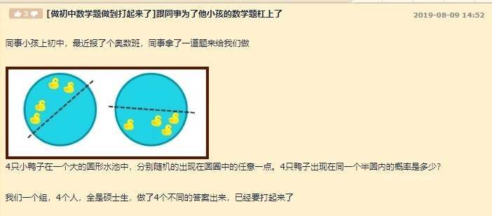

# Monte carlo simulation of four duck semicircle problems
# 四只鸭子共半圆问题的蒙特卡洛模拟（CPU并行计算）

## 问题描述：
就是4只鸭子在一个圆,求他们在一个半圆的概率。
其实如果用半径和弧度来表示鸭子的位置,可以避开平面坐标二次项的麻烦。
而且显然鸭子是否属于一个半圆只与它们的弧度有关,与它们距离圆心的距离无关。
（4只鸭子属于一个半圆的充要条件:其中一只鸭子顺时针转180度,或逆时针转180度,可以扫遍其它的鸭子）

## 算法组成
1. 使用向量法判定点与直线的关系
2. 划分采样点，实现多进程加速(数据并行)
3. 提供了友好的过程可视化

## 使用注意事项
1. 请根据你计算的性能和预期使用的时间调整采样点数量
2. 根据你计算机的核心数(超线程数)调整cpu_num变量

## TO DO LIST
1. 动态生成采样点
2. 动态绘制result结果,并加入收敛判定函数
